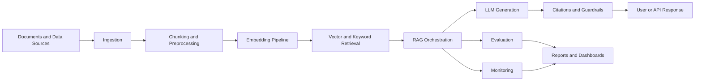

# AWS Enterprise Multimodal RAG Platform

Production-style foundation for an AWS GenAI, AI Engineering, LLMOps, Enterprise RAG, and Multimodal AI platform.

## Problem Statement

Enterprises need trusted AI systems that can answer questions over internal knowledge, cite sources, handle multiple document types, evaluate quality, enforce guardrails, and expose operational health to technical and business stakeholders. Building these systems requires more than a chatbot: it requires retrieval design, evaluation discipline, observability, governance, experimentation, and a clear path to cloud deployment.

## Why This Project Matters

This repository is designed as a portfolio-ready foundation for a realistic enterprise GenAI platform. It demonstrates how a local-first system can be structured before connecting to managed AWS services, paid APIs, or production data. The project emphasizes modularity, testability, governance, and measurable AI quality.

## Target Roles

- AWS GenAI Engineer
- AI Engineer
- Applied Scientist
- Data Scientist
- LLMOps Engineer
- Machine Learning Engineer
- Enterprise RAG Engineer
- Multimodal AI Engineer

## High-Level Architecture

The intended platform architecture separates ingestion, chunking, embeddings, retrieval, generation, citations, guardrails, evaluation, recommendations, agent workflows, monitoring, and reporting.



## AWS Service Mapping

This milestone uses local placeholders only. The future AWS architecture is expected to map platform responsibilities to:

| Capability | Candidate AWS Services |
| --- | --- |
| Foundation models and embeddings | Amazon Bedrock, Amazon SageMaker |
| Document storage | Amazon S3 |
| Search and retrieval | Amazon OpenSearch Service |
| Serverless orchestration | AWS Lambda, AWS Step Functions |
| API access | Amazon API Gateway |
| Metadata and session state | Amazon DynamoDB |
| Monitoring and logs | Amazon CloudWatch |
| Access control | AWS IAM |
| Document extraction | Amazon Textract |
| Analytics and reporting | Amazon Redshift |
| Streaming events | Amazon Kinesis |

## MVP Scope

Milestone 1 establishes the repository foundation:

- Project structure and Python package skeleton
- Configuration placeholders
- Documentation placeholders
- Sample policy document and evaluation questions
- GitHub Actions CI placeholder
- Structure tests to protect the initial architecture

Milestone 2 adds local document ingestion and preprocessing:

- Load local sample Markdown and plain text enterprise documents
- Create structured document records with source metadata and counts
- Normalize text while preserving useful headings
- Split clean text into configurable overlapping chunks
- Save local processed outputs for future RAG, evaluation, guardrails, and agent workflows

No embeddings, retrieval, agents, cloud integration, paid services, secrets, credentials, or real model calls are implemented in these milestones.

## Future Scope

- Local document ingestion and parsing
- Chunking strategies for text and multimodal metadata
- Mock embedding and retrieval interfaces
- Local RAG orchestration with citations
- Evaluation harness for answer quality, retrieval quality, latency, and safety
- Guardrail policies and refusal behavior tests
- Recommender and knowledge graph extensions
- Agentic workflows for monitoring and root-cause analysis
- A/B testing and experiment tracking
- Dashboard and reporting layer
- AWS deployment blueprint using managed services

## Folder Structure

```text
.
├── config/                         # Local config placeholders for RAG, models, evaluation, guardrails, and AWS mapping
├── data/                           # Knowledge base, evaluation, and sample datasets
├── docs/                           # Architecture and strategy documentation
├── documents/                      # Raw, processed, and sample enterprise documents
├── outputs/                        # Local generated outputs and artifacts
├── prompts/                        # System, RAG, evaluation, and agent prompt templates
├── reports/                        # Local reports and dashboard-ready artifacts
├── src/enterprise_rag_platform/    # Python package skeleton
└── tests/                          # Automated tests
```

## Document Ingestion and Preprocessing

Milestone 2 creates clean, structured document records and chunks from local sample enterprise documents. Run the local pipeline with:

```bash
python -m enterprise_rag_platform.ingestion.ingestion_runner
```

The pipeline reads from `documents/sample/`, writes processed records to `data/processed/documents.json`, writes chunks to `data/processed/document_chunks.json`, and creates `reports/document_ingestion_report.md`.

## Milestones

1. Repository setup and architecture foundation
2. Local ingestion and preprocessing pipeline
3. Mock retrieval and generation interfaces
4. Evaluation and benchmarking harness
5. Guardrails and citation validation
6. Reporting and dashboard prototypes
7. AWS architecture implementation plan
8. Optional cloud deployment with secure configuration

## Definition of Done

For this milestone, done means:

- Required root files exist
- Required folders exist
- Python package skeleton is importable
- Placeholder config, docs, sample, output, and report files exist
- GitHub Actions CI is present
- Basic project structure tests pass locally
- The repository clearly communicates its intended AWS GenAI and Enterprise RAG direction

## Disclaimer

The current version is local-first and uses mock components and placeholders only. It does not connect to AWS, paid services, production systems, private datasets, or real model APIs. Secrets, credentials, and real API keys must never be committed to this repository.
